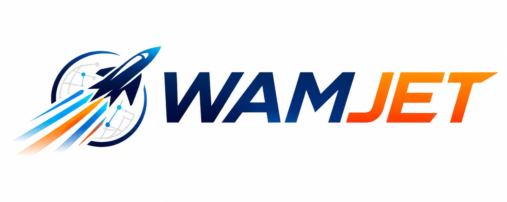

<div align="center" id="top">
  

**A Harness for World Action Model Acceleration**

[Le Chen](https://clthegoat.github.io/)<sup>1</sup>, [Lixin Liu](https://liulixinkerry.github.io/)<sup>2,†</sup>, [Jan Schneider](https://ei.is.mpg.de/person/jschneider)<sup>1</sup>, [Zeju Qiu](https://is.mpg.de/ei/person/zqiu)<sup>1</sup>, [Simon Guist](https://is.mpg.de/ei/person/sguist)<sup>1</sup>, [Bernhard Schölkopf](https://is.mpg.de/ei/person/bs)<sup>1</sup>, [Dieter Büchler](https://ei.is.mpg.de/person/dbuechler)<sup>1,3</sup>

<sup>1</sup>Max Planck Institute for Intelligent Systems · <sup>2</sup>The Chinese University of Hong Kong · <sup>3</sup>Johannes Kepler University Linz<br>  <sup>†</sup>Corresponding author

🚀 [Quick Start](#quick-start) | 📄 [Paper](https://arxiv.org/abs/2610.03797) | 🌐 [Project Page](https://liulixinkerry.github.io/WAMJET/index.html)

</div>


## Overview

**WAMJET** is a harness that equips coding agents to develop acceleration strategies tailored to different WAMs and GPU architectures. It delivers substantial speedups over upstream implementations while preserving action quality.


WAMJET provides reusable guidance and tools for:
- Startup optimization
- Bottleneck analysis
- Lossless acceleration
- Architecture-aware approximation
- Iterative validation


## Quick Start

Follow [PROMPTS.md](PROMPTS.md) for example prompts to launch WAMJET lossless and approximate optimization campaigns.

## Usage Guide
See [USAGE.md](USAGE.md) for the WAMJET optimization workflow, tools, benchmarking, and validation procedures.

## Citation

Please cite this work as:
```
@article{chen2026wamjet,
  title={WAMJET: A Harness for World Action Model Acceleration},
  author={Chen, Le and Liu, Lixin and Schneider, Jan and Qiu, Zeju and Guist, Simon and Sch{\"o}lkopf, Bernhard and B{\"u}chler, Dieter},
  journal={arXiv preprint arXiv:2610.03797},
  year={2026}
}
```

## License
WAMJET is an open source project licensed under [BSD 3-Clause License](LICENSE).
