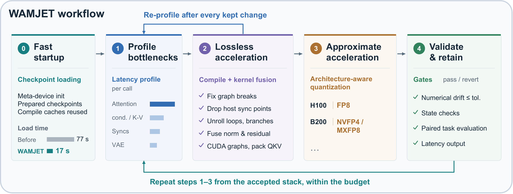

# WAMJET: A Harness for World Action Model Acceleration

WAMJET is an agentic harness that accelerates WAM inference by equipping coding agents with reusable optimization guidance and measurement and validation tools.

## Workflow

WAMJET follows a bottleneck-driven workflow where the agent profiles inference, modifies targeted code, validates effects, and iteratively refines the acceleration stack as bottlenecks shift, while preserving action quality.

## How to Start 

Follow [PROMPTS.md](PROMPTS.md) to start a WAMJET campaign. Adapt the paths, model and resources to your environment.

## Skill User Guide
See [USAGE.md](USAGE.md) for setup, tools and validation details.

## Citation

## License
WAMJET is an open source project licensed under [BSD 3-Clause License](LICENSE).
