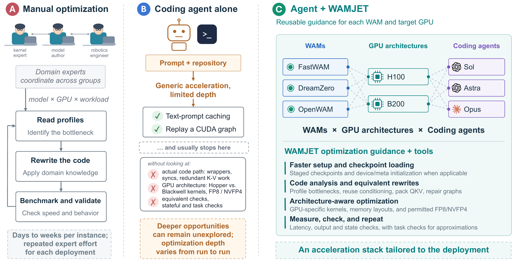
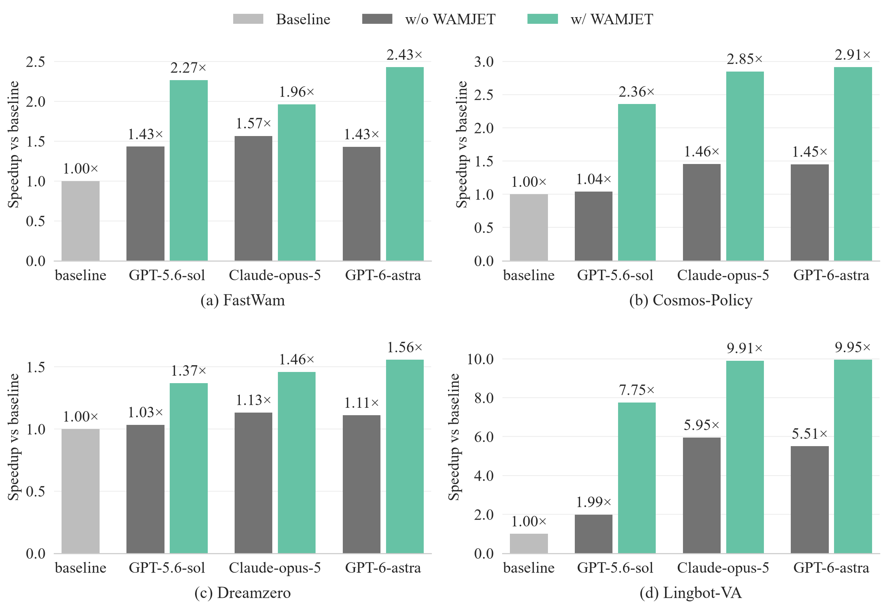
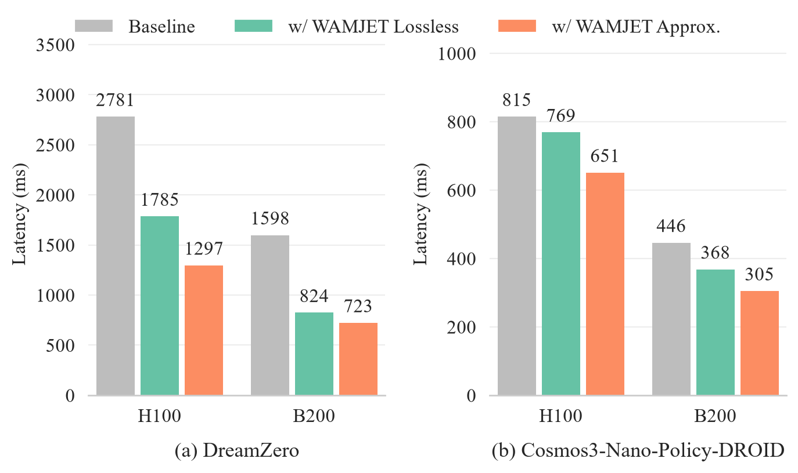
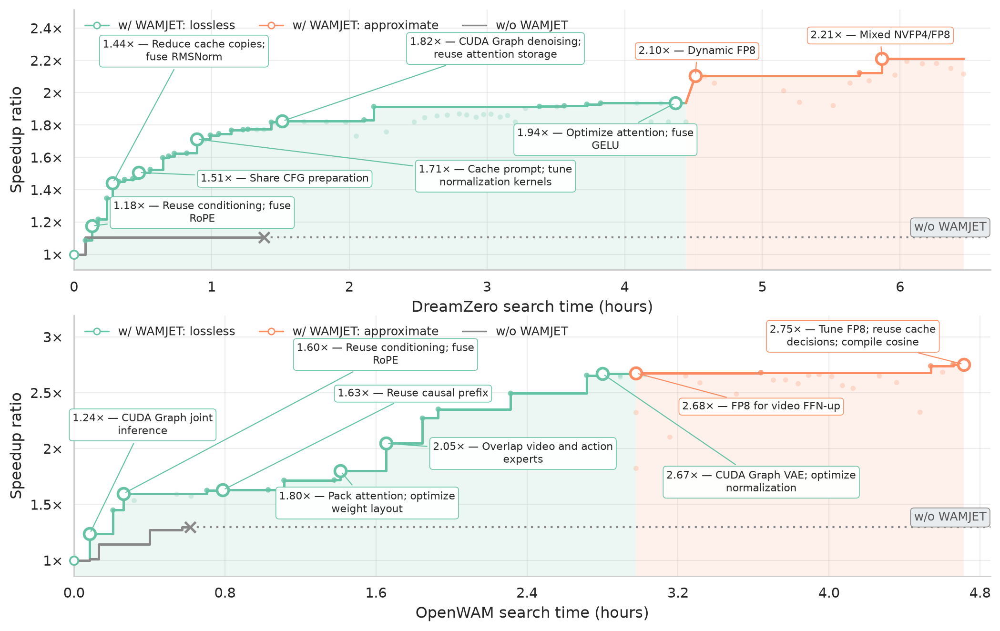

<div align="center" id="top">

# WAMJET: A Harness for World Action Model Acceleration

[Le Chen](https://clthegoat.github.io/)<sup>1</sup>, [Lixin Liu](https://liulixinkerry.github.io/)<sup>2,†</sup>, [Jan Schneider](https://ei.is.mpg.de/person/jschneider)<sup>1</sup>, [Zeju Qiu](https://is.mpg.de/ei/person/zqiu)<sup>1</sup>, [Simon Guist](https://is.mpg.de/ei/person/sguist)<sup>1</sup>,<br>[Bernhard Schölkopf](https://is.mpg.de/ei/person/bs)<sup>1</sup>, [Dieter Büchler](https://ei.is.mpg.de/person/dbuechler)<sup>1,3</sup>

<sup>1</sup>Max Planck Institute for Intelligent Systems · <sup>2</sup>The Chinese University of Hong Kong · <sup>3</sup>Johannes Kepler University Linz<br>  <sup>†</sup>Corresponding author<br>Sep 2026 | 🤖 [Code](https://github.com/liulixinkerry/WAMJET) | 📄 [Paper](https://arxiv.org/abs/2610.03797)


</div>

## Abstract

World Action Models (WAMs) leverage pretrained video foundation models for robot manipulation, but their large backbones and video-action co-prediction are expensive. Although existing acceleration techniques offer many ways to reduce this cost, selecting and composing them requires substantial engineering for each model and hardware platform. To tackle this bottleneck, we present WAMJET, an agentic harness that accelerates WAM inference by equipping coding agents with reusable optimization guidance and measurement and validation tools. WAMJET follows a bottleneck-driven workflow where the agent profiles inference, modifies targeted code, validates effects, and iteratively refines the acceleration stack as bottlenecks shift, while preserving action quality. Experiments span six WAMs, three coding agents, and two GPU architectures. WAMJET achieves up to 9.95× lossless speedup over upstream implementations. Approximation and hardware-aware optimization yield additional latency reductions, with comparable success rates. The results show that WAMJET can produce effective acceleration stacks for WAM deployment.

## Why WAMJET



Existing WAM acceleration techniques offer many ways to reduce inference cost, but hand-crafting them for each model and hardware platform requires substantial engineering and may not generalize.

**WAMJET** addresses this bottleneck with a harness that equips coding agents to develop acceleration strategies tailored to different WAMs and GPU architectures.

## WAMJET Workflow


WAMJET's bottleneck-driven optimization workflow. The agent reduces startup costs, profiles inference to identify bottlenecks, explores lossless acceleration followed by approximate techniques when permitted, and validates candidates. The agent retains accepted changes, reassesses the remaining bottlenecks, and continues searching within the specified budget.

## Results
### Lossless Acceleration across Different Agents and WAMs

Our first set of experiments evaluates WAMJET's effectiveness for lossless acceleration and its generality across different combinations of coding agents and WAMs on H100.

<div align="center">



</div>

All 12 WAMJET configurations outperform their corresponding no-WAMJET baselines. For LingBot-VA, WAMJET achieves a significant 9.95× speedup with GPT-6-astra, suggesting greater benefits from more advanced coding agents. 

We also observe that more optimization rounds leads to better optimization. See our paper's Table II for more details.

### Approximate Acceleration across GPU Architectures

Our second set of experiments demonstrates WAMJET's support for architecture-aware optimization. 


<div align="center">



</div>

The WAMJET-guided agent selects and refines quantization strategies through profiling and empirical search, adapting them to the target model and GPU architecture.
On H100, both DreamZero and Cosmos3 use dynamic FP8. On B200, DreamZero uses a mixed-precision configuration: NVFP4 for the feed-forward projections and FP8 for the remaining linears. Cosmos3 instead uses MXFP8 for its projections.

We further evaluate task success on a RoboLab subset and find that WAMJET can preserve action quality and task performance for approximate acceleration. See our paper's Table IV for more details.

### Further Optimization of Recent SOTA WAM

Wang et al. recently released OpenWAM, which achieves SOTA performance across several robotic benchmarks. 
OpenWAM already incorporates several inference optimizations, such as the PyTorch compiler and velocity cache, making it a useful test of whether WAMJET can guide an agent to find further optimization opportunities.

We apply WAMJET-guided GPT-6-astra to optimize OpenWAM on B200, and evaluate on full LIBERO and full LIBERO-plus.

| Config             | Precision | Latency (ms) | Speedup | LIBERO  | LIBERO-plus |
|:------------------:|:---------:|:------------:|:-------:|:-------:|:-----------:|
| Baseline           | BF16      | 87.25        | 1.00×   | 98.95%  | 69.27%      |
| w/ WAMJET Lossless | BF16      | 32.69        | 2.67×   | 99.10%  | 69.24%      |
| w/ WAMJET Approx.  | FP8       | 31.70        | 2.75×   | 99.25%  | 69.30%      |

These results show that the guided agent can identify substantial acceleration opportunities even in an already highly optimized inference pipeline.

### Optimization Progress over Search Time

We plot the optimization progress of GPT-6-astra on DreamZero and OpenWAM using B200. The figures show individual trials and accepted optimization trajectories, illustrating how performance improves through iterative exploration.



With WAMJET, the coding agent autonomously identifies bottlenecks and explores optimization opportunities, while agents without the harness tend to terminate early. Despite sharing techniques such as CUDA Graphs and operator fusion, DreamZero and OpenWAM converge to different optimization recipes, indicating the guided agent's adaptive, model-specific optimization strategies.

## Citation

Please cite this work as:
```bibtex
@article{chen2026wamjet,
  title={WAMJET: A Harness for World Action Model Acceleration},
  author={Chen, Le and Liu, Lixin and Schneider, Jan and Qiu, Zeju
                   and Guist, Simon and Sch{\"o}lkopf, Bernhard and B{\"u}chler, Dieter},
  journal={arXiv preprint arXiv:2610.03797},
  year={2026}
}
```